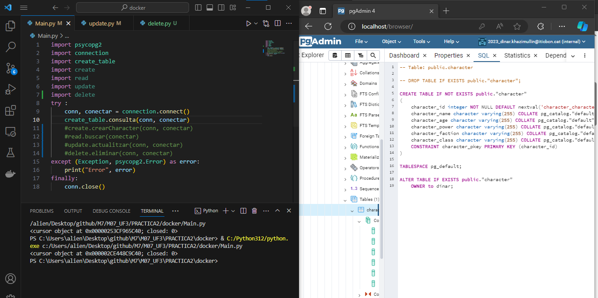

# M07_UF3
## Dinar Khazimullin
### Conexio

### Creat Taula

### Llegir personatges

### Crear personatges

### Actualitzar personatge

### Eliminar personatge
![Eliminar personatge]t(PRACTICA2/img/delete.png)